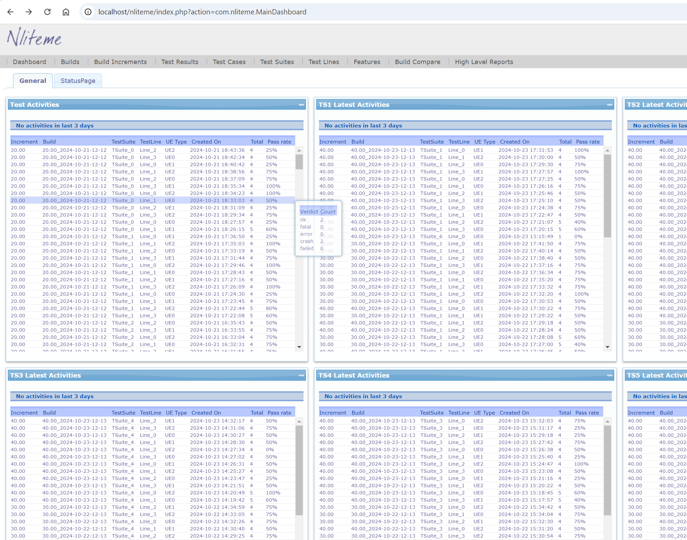
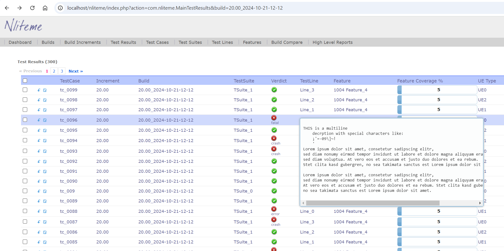
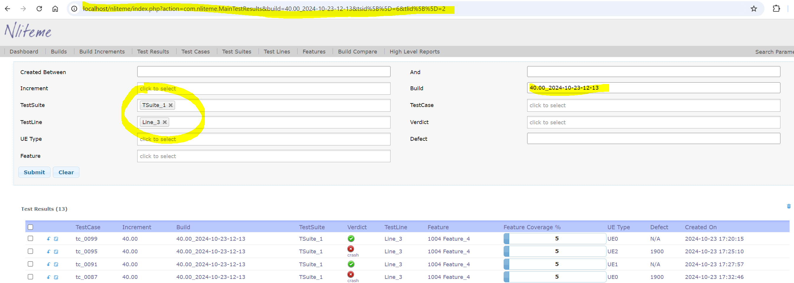
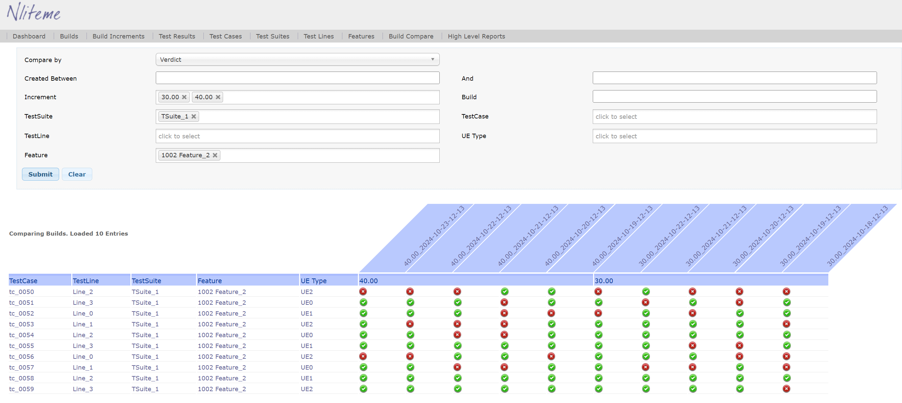
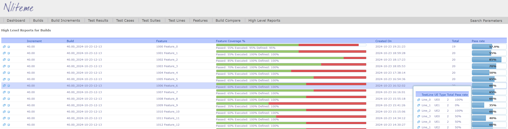
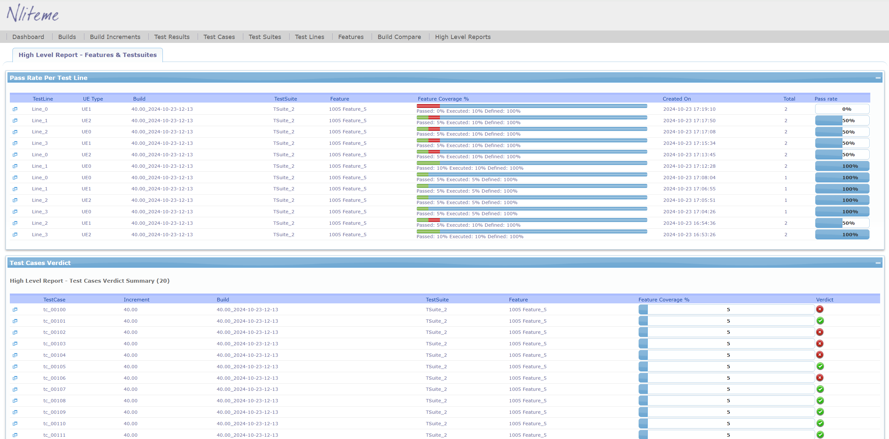

# Nliteme

**Nliteme** (short for *New Lite Test Management Engine*) is a platform-independent test management application featuring:

- An **SQL database** and **PHP backend**
- A **web-based GUI front-end**
- A lightweight **RESTful API**

It is optimized for collecting, managing, and visualizing test execution results from **automated regression test systems**.

---

## Key Features

### ✅ Easy RESTful API

Seamlessly integrates with existing test systems *as-is* to:

- Upload test execution results with minimal overhead
- Automate queries, searches, and filtering of stored data

### 🧭 Web GUI Front-End

- Quickly browse, search, and compare test results across different software (SW) releases
- Efficient filtering to help identify issues in tested software and/or hardware

### 📊 Configurable Dashboard

- Provides a quick overview of the latest testing activity

### 📋 High-Level Report View

- Summarizes test results across test lines, SW releases, and builds

### 🔍 Build Compare View

- Enables comparison of test results across builds  
- Ideal for **project tracking** and **release planning**

---

## 🖥 Platform Compatibility

Nliteme is **platform-independ**

## HowTos
- [`Installation manual`](./doc/NlitemeInstallationGuide.pdf)
- [`User Guide`](./doc/NlitemeUserGuide.pdf)

## Screenshots

- Dashboard

- Test Results

- Test Results Filtering

- Test Results Filtering

- Build Compare

- HighLevelReport

- HighLevelReport Details

- HighLevelReport Details

